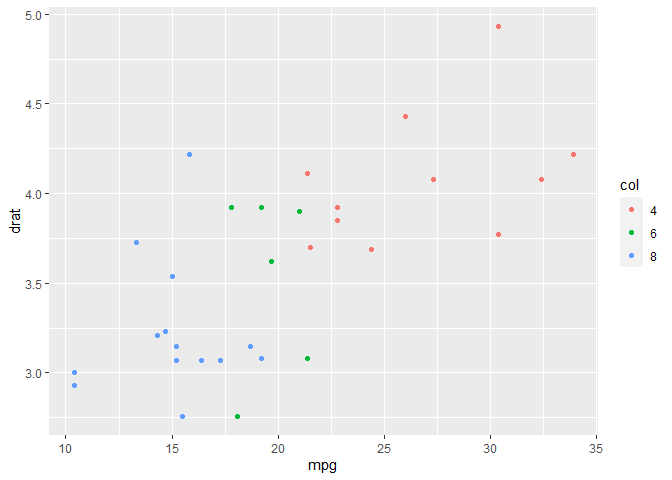



gggA1

```r
ggplot(data.table(mtcars)[,col:=as.factor(cyl)],aes(mpg,drat,color=col))+geom_point()
```

<!-- -->
gggA2

gggB1


```{=html}
<div id="htmlwidget-eac1308c7080cb732ef6" style="width:672px;height:480px;" class="plotly html-widget"></div>
<script type="application/json" data-for="htmlwidget-eac1308c7080cb732ef6">{"x":{"data":[{"x":[22.8,24.4,22.8,32.4,30.4,33.9,21.5,27.3,26,30.4,21.4],"y":[3.85,3.69,3.92,4.08,4.93,4.22,3.7,4.08,4.43,3.77,4.11],"text":["mpg: 22.8<br />drat: 3.85<br />col: 4","mpg: 24.4<br />drat: 3.69<br />col: 4","mpg: 22.8<br />drat: 3.92<br />col: 4","mpg: 32.4<br />drat: 4.08<br />col: 4","mpg: 30.4<br />drat: 4.93<br />col: 4","mpg: 33.9<br />drat: 4.22<br />col: 4","mpg: 21.5<br />drat: 3.70<br />col: 4","mpg: 27.3<br />drat: 4.08<br />col: 4","mpg: 26.0<br />drat: 4.43<br />col: 4","mpg: 30.4<br />drat: 3.77<br />col: 4","mpg: 21.4<br />drat: 4.11<br />col: 4"],"type":"scatter","mode":"markers","marker":{"autocolorscale":false,"color":"rgba(248,118,109,1)","opacity":1,"size":5.66929133858268,"symbol":"circle","line":{"width":1.88976377952756,"color":"rgba(248,118,109,1)"}},"hoveron":"points","name":"4","legendgroup":"4","showlegend":true,"xaxis":"x","yaxis":"y","hoverinfo":"text","frame":null},{"x":[21,21,21.4,18.1,19.2,17.8,19.7],"y":[3.9,3.9,3.08,2.76,3.92,3.92,3.62],"text":["mpg: 21.0<br />drat: 3.90<br />col: 6","mpg: 21.0<br />drat: 3.90<br />col: 6","mpg: 21.4<br />drat: 3.08<br />col: 6","mpg: 18.1<br />drat: 2.76<br />col: 6","mpg: 19.2<br />drat: 3.92<br />col: 6","mpg: 17.8<br />drat: 3.92<br />col: 6","mpg: 19.7<br />drat: 3.62<br />col: 6"],"type":"scatter","mode":"markers","marker":{"autocolorscale":false,"color":"rgba(0,186,56,1)","opacity":1,"size":5.66929133858268,"symbol":"circle","line":{"width":1.88976377952756,"color":"rgba(0,186,56,1)"}},"hoveron":"points","name":"6","legendgroup":"6","showlegend":true,"xaxis":"x","yaxis":"y","hoverinfo":"text","frame":null},{"x":[18.7,14.3,16.4,17.3,15.2,10.4,10.4,14.7,15.5,15.2,13.3,19.2,15.8,15],"y":[3.15,3.21,3.07,3.07,3.07,2.93,3,3.23,2.76,3.15,3.73,3.08,4.22,3.54],"text":["mpg: 18.7<br />drat: 3.15<br />col: 8","mpg: 14.3<br />drat: 3.21<br />col: 8","mpg: 16.4<br />drat: 3.07<br />col: 8","mpg: 17.3<br />drat: 3.07<br />col: 8","mpg: 15.2<br />drat: 3.07<br />col: 8","mpg: 10.4<br />drat: 2.93<br />col: 8","mpg: 10.4<br />drat: 3.00<br />col: 8","mpg: 14.7<br />drat: 3.23<br />col: 8","mpg: 15.5<br />drat: 2.76<br />col: 8","mpg: 15.2<br />drat: 3.15<br />col: 8","mpg: 13.3<br />drat: 3.73<br />col: 8","mpg: 19.2<br />drat: 3.08<br />col: 8","mpg: 15.8<br />drat: 4.22<br />col: 8","mpg: 15.0<br />drat: 3.54<br />col: 8"],"type":"scatter","mode":"markers","marker":{"autocolorscale":false,"color":"rgba(97,156,255,1)","opacity":1,"size":5.66929133858268,"symbol":"circle","line":{"width":1.88976377952756,"color":"rgba(97,156,255,1)"}},"hoveron":"points","name":"8","legendgroup":"8","showlegend":true,"xaxis":"x","yaxis":"y","hoverinfo":"text","frame":null}],"layout":{"margin":{"t":26.2283105022831,"r":7.30593607305936,"b":40.1826484018265,"l":43.1050228310502},"plot_bgcolor":"rgba(235,235,235,1)","paper_bgcolor":"rgba(255,255,255,1)","font":{"color":"rgba(0,0,0,1)","family":"","size":14.6118721461187},"xaxis":{"domain":[0,1],"automargin":true,"type":"linear","autorange":false,"range":[9.225,35.075],"tickmode":"array","ticktext":["10","15","20","25","30","35"],"tickvals":[10,15,20,25,30,35],"categoryorder":"array","categoryarray":["10","15","20","25","30","35"],"nticks":null,"ticks":"outside","tickcolor":"rgba(51,51,51,1)","ticklen":3.65296803652968,"tickwidth":0.66417600664176,"showticklabels":true,"tickfont":{"color":"rgba(77,77,77,1)","family":"","size":11.689497716895},"tickangle":-0,"showline":false,"linecolor":null,"linewidth":0,"showgrid":true,"gridcolor":"rgba(255,255,255,1)","gridwidth":0.66417600664176,"zeroline":false,"anchor":"y","title":{"text":"mpg","font":{"color":"rgba(0,0,0,1)","family":"","size":14.6118721461187}},"hoverformat":".2f"},"yaxis":{"domain":[0,1],"automargin":true,"type":"linear","autorange":false,"range":[2.6515,5.0385],"tickmode":"array","ticktext":["3.0","3.5","4.0","4.5","5.0"],"tickvals":[3,3.5,4,4.5,5],"categoryorder":"array","categoryarray":["3.0","3.5","4.0","4.5","5.0"],"nticks":null,"ticks":"outside","tickcolor":"rgba(51,51,51,1)","ticklen":3.65296803652968,"tickwidth":0.66417600664176,"showticklabels":true,"tickfont":{"color":"rgba(77,77,77,1)","family":"","size":11.689497716895},"tickangle":-0,"showline":false,"linecolor":null,"linewidth":0,"showgrid":true,"gridcolor":"rgba(255,255,255,1)","gridwidth":0.66417600664176,"zeroline":false,"anchor":"x","title":{"text":"drat","font":{"color":"rgba(0,0,0,1)","family":"","size":14.6118721461187}},"hoverformat":".2f"},"shapes":[{"type":"rect","fillcolor":null,"line":{"color":null,"width":0,"linetype":[]},"yref":"paper","xref":"paper","x0":0,"x1":1,"y0":0,"y1":1}],"showlegend":true,"legend":{"bgcolor":"rgba(255,255,255,1)","bordercolor":"transparent","borderwidth":1.88976377952756,"font":{"color":"rgba(0,0,0,1)","family":"","size":11.689497716895},"y":0.93503937007874},"annotations":[{"text":"col","x":1.02,"y":1,"showarrow":false,"ax":0,"ay":0,"font":{"color":"rgba(0,0,0,1)","family":"","size":14.6118721461187},"xref":"paper","yref":"paper","textangle":-0,"xanchor":"left","yanchor":"bottom","legendTitle":true}],"hovermode":"closest","barmode":"relative"},"config":{"doubleClick":"reset","showSendToCloud":false},"source":"A","attrs":{"21d898511c5":{"x":{},"y":{},"colour":{},"type":"scatter"}},"cur_data":"21d898511c5","visdat":{"21d898511c5":["function (y) ","x"]},"highlight":{"on":"plotly_click","persistent":false,"dynamic":false,"selectize":false,"opacityDim":0.2,"selected":{"opacity":1},"debounce":0},"shinyEvents":["plotly_hover","plotly_click","plotly_selected","plotly_relayout","plotly_brushed","plotly_brushing","plotly_clickannotation","plotly_doubleclick","plotly_deselect","plotly_afterplot","plotly_sunburstclick"],"base_url":"https://plot.ly"},"evals":[],"jsHooks":[]}</script>
```
gggB2
