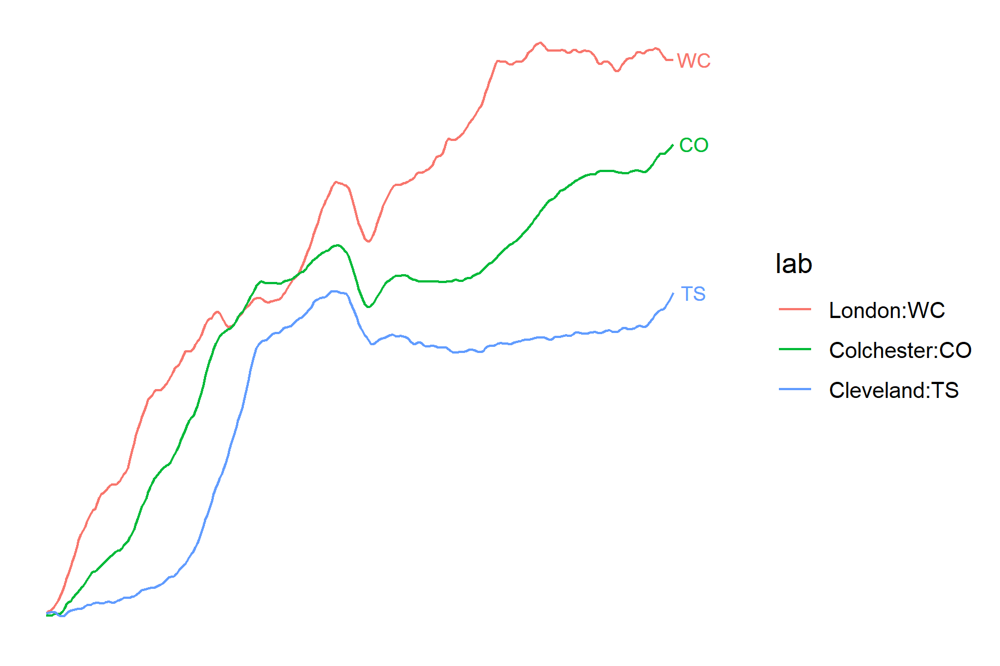
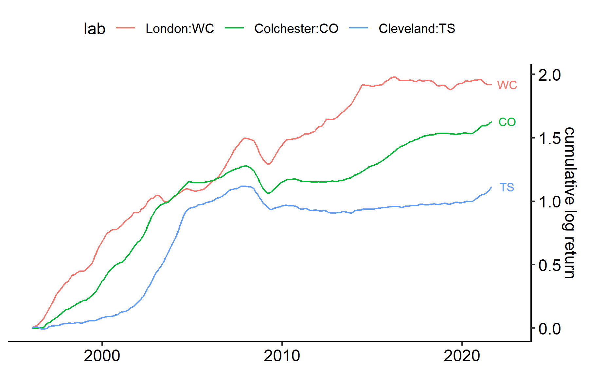
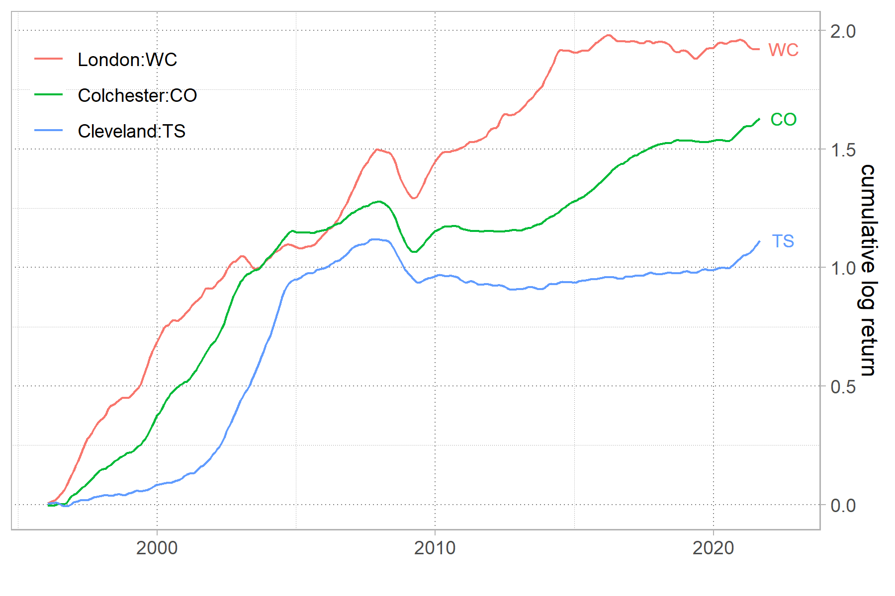
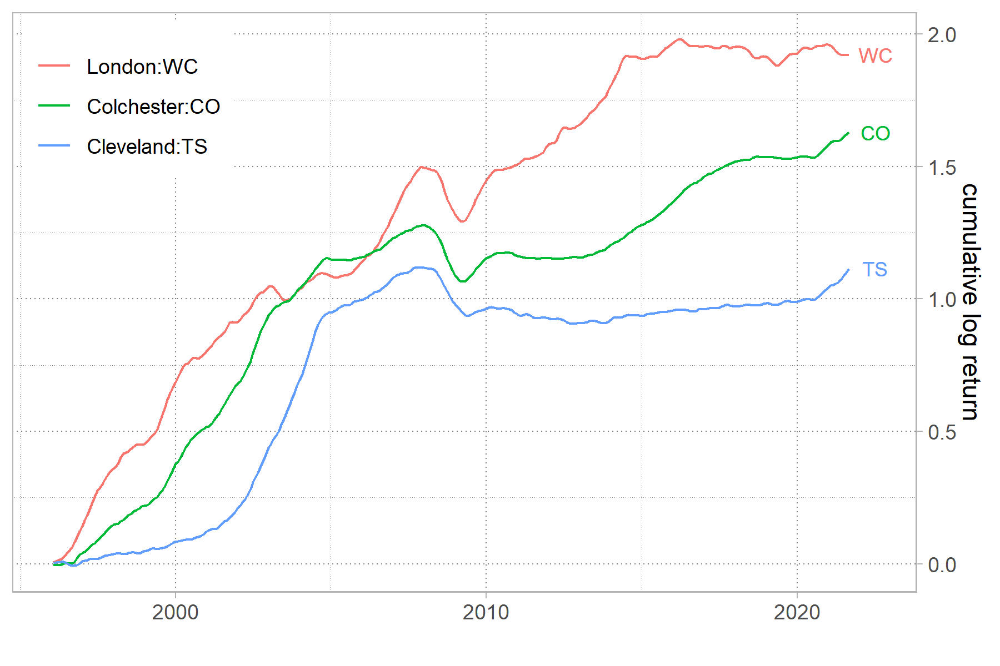
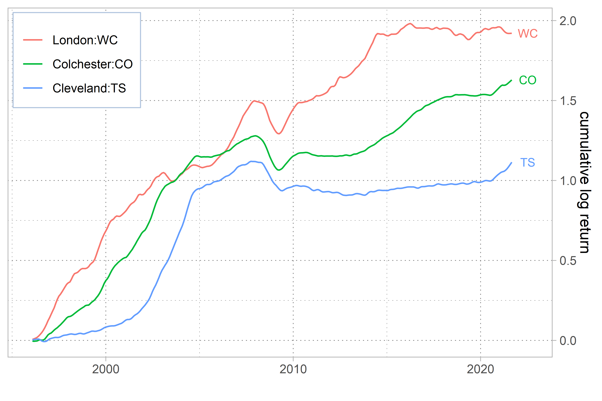
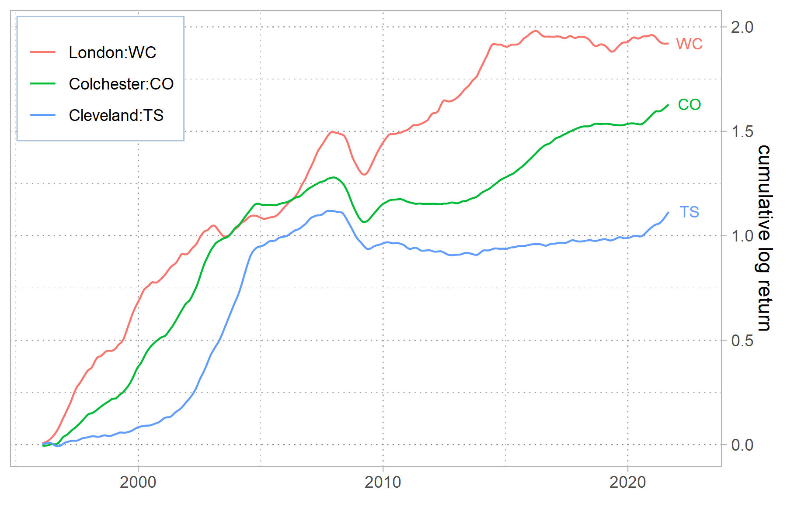
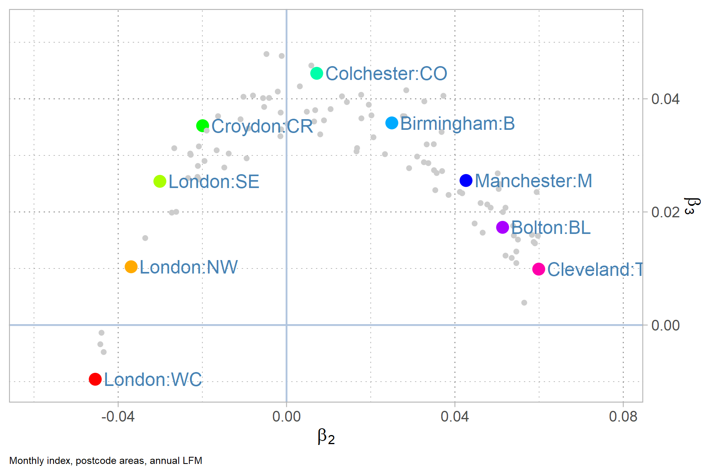

## g1

theme_transparent()

## g2

theme_transparent()+theme_pubr()

## g3

theme(
    panel.background = element_rect(fill = "transparent", colour = NA),
    legend.background = element_rect(fill = "transparent", colour = NA),
    plot.background = element_rect(fill = "transparent", colour = NA))

## gdefault

## gcairo600

(cairo 600)

## gcairo300

(cairo 300)

## g050

(cairo 300)

## leaflet

<iframe seamless src="leafmap/index.html" width="100%" height="500"></iframe>

## plotly

<iframe seamless src="plotly/index.html" width="100%" height="500"></iframe>

